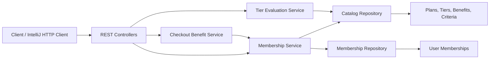

# FirstClub Membership Program

[](https://openjdk.org/)
[](https://spring.io/projects/spring-boot)
[](https://maven.apache.org/)

A demo-ready Spring Boot backend for subscription-based memberships with configurable plans, tier benefits, lifecycle management, and rule-based tier eligibility.

The solution focuses on clean domain modelling, modularity, extensibility, API usability, and concurrency-aware membership updates.

## Highlights

- Monthly, quarterly, and yearly membership plans
- Silver, Gold, and Platinum tiers
- YAML-configurable plans, tier criteria, and benefits
- Subscribe, upgrade, downgrade, cancel, and track expiry
- Resubscribe after cancellation or expiry
- Tier evaluation using order count, order value, and user cohorts
- Evaluate and automatically apply the eligible tier
- Calculate membership discounts and delivery benefits at checkout
- Per-user locking for concurrent membership operations
- Optimistic version checks in the repository
- Consistent REST error responses
- Eleven automated tests, including configuration and concurrent subscription tests
- Ready-to-run IntelliJ HTTP requests in `api-tests.http`

## Tech Stack

| Area | Technology |
|---|---|
| Language | Java 17+ |
| Framework | Spring Boot 3.3.5 |
| API | Spring Web / REST |
| Build | Maven |
| Testing | JUnit 5, AssertJ |
| Configuration | Type-safe Spring configuration properties and YAML |
| Storage | Thread-safe in-memory repositories |

The catalog is configured in `application.yml`, so plan prices, tier rules, cohorts, and benefits can change without editing business logic. In-memory storage keeps the assignment easy to run and review, while repository boundaries allow it to be replaced with JPA, Redis, or another persistence layer without changing the API contract.

## Architecture



### Package responsibilities

```text
com.firstclub.membership
|-- domain       Core membership, plan, tier, benefit, and criteria models
|-- dto          API request, response, and error contracts
|-- repository   Catalog and user-membership storage abstractions
|-- service      Membership lifecycle and tier evaluation business logic
|-- web          REST controllers and centralized exception handling
```

## Domain Model

### Membership plan

A plan defines the commercial subscription period:

| Plan ID | Duration | Price |
|---|---:|---:|
| `monthly` | 1 month | INR 199 |
| `quarterly` | 3 months | INR 499 |
| `yearly` | 12 months | INR 1,499 |

### Membership tier

A tier defines qualification criteria and unlocked benefits:

| Tier | Minimum Orders | Minimum Monthly Value | Example Cohorts |
|---|---:|---:|---|
| Silver | 0 | INR 0 | Available to all |
| Gold | 5 | INR 5,000 | `power-shopper`, `employee` |
| Platinum | 10 | INR 15,000 | `vip`, `employee` |

Benefits are represented as typed values such as free delivery, extra discount percentage, early sale access, exclusive deals, coupons, and priority support.

## Key Design Decisions

### Clear separation of responsibilities

Controllers handle HTTP concerns, services own business workflows, repositories own storage, and domain objects represent membership concepts. This keeps business logic independent from transport and persistence details.

### Configurable tier model

Tier criteria and benefits are data-driven rather than embedded in controller logic. New benefits or qualification inputs can be introduced without rewriting the subscription lifecycle.

### Concurrency-aware mutations

Membership mutations use a per-user `ReentrantLock`. Requests for different users can proceed concurrently, while operations for the same user are serialized.

The repository also validates membership versions before replacement. This provides a second guard against stale or conflicting writes.

### Explicit membership lifecycle

A membership has a status of `ACTIVE`, `CANCELLED`, or `EXPIRED`. Expiry is evaluated against a UTC `Clock`, which also makes time-based service behavior testable.

### Consistent API errors

Centralized exception handling maps domain failures to predictable HTTP responses:

| Situation | Status |
|---|---:|
| Invalid input | `400 Bad Request` |
| Missing plan, tier, or membership | `404 Not Found` |
| Duplicate or conflicting operation | `409 Conflict` |
| Unexpected error | `500 Internal Server Error` |

## REST API

Base URL:

```text
http://localhost:8080
```

| Method | Endpoint | Purpose |
|---|---|---|
| `GET` | `/api/plans` | List available plans |
| `GET` | `/api/tiers` | List tiers, criteria, and benefits |
| `POST` | `/api/memberships/subscribe` | Subscribe a user to a plan and tier |
| `GET` | `/api/memberships/{userId}` | Get current membership and expiry |
| `POST` | `/api/memberships/{userId}/change-tier` | Upgrade or downgrade a tier |
| `POST` | `/api/memberships/{userId}/evaluate-tier` | Calculate the highest eligible tier |
| `POST` | `/api/memberships/{userId}/evaluate-and-apply-tier` | Evaluate and atomically apply the eligible tier |
| `POST` | `/api/memberships/{userId}/checkout-benefits` | Calculate delivery and discount benefits |
| `POST` | `/api/memberships/{userId}/cancel` | Cancel an active membership |

## Example Flow

### 1. Subscribe

```http
POST /api/memberships/subscribe
Content-Type: application/json
```

```json
{
  "userId": "user-101",
  "planId": "monthly",
  "tierId": "silver"
}
```

Example response:

```json
{
  "userId": "user-101",
  "plan": {
    "id": "monthly",
    "type": "MONTHLY",
    "price": 199.00,
    "durationMonths": 1,
    "currency": "INR"
  },
  "tier": {
    "id": "silver",
    "name": "Silver",
    "rank": 1
  },
  "subscribedAt": "2026-06-09T10:00:00Z",
  "expiresAt": "2026-07-09T10:00:00Z",
  "status": "ACTIVE",
  "version": 0
}
```

The real tier response also includes its criteria and benefits.

### 2. Change tier

```http
POST /api/memberships/user-101/change-tier
Content-Type: application/json
```

```json
{
  "tierId": "gold"
}
```

### 3. Evaluate eligibility

```http
POST /api/memberships/user-101/evaluate-tier
Content-Type: application/json
```

```json
{
  "monthlyOrderCount": 12,
  "monthlyOrderValue": 20000,
  "cohorts": ["vip"]
}
```

### 4. Apply eligibility automatically

```http
POST /api/memberships/user-101/evaluate-and-apply-tier
Content-Type: application/json
```

The response includes the evaluated tier, whether the membership changed, and the updated membership. Evaluation and update execute under the same per-user lock.

### 5. Calculate checkout benefits

```http
POST /api/memberships/user-101/checkout-benefits
Content-Type: application/json
```

```json
{
  "orderValue": 2500,
  "deliveryEligible": true,
  "selectedItemsEligible": true
}
```

Example response for a Gold member:

```json
{
  "userId": "user-101",
  "tierId": "gold",
  "freeDelivery": true,
  "discountPercent": 10,
  "discountAmount": 250.00,
  "payableOrderValue": 2250.00
}
```

The real response also returns all benefits available to the tier.

Example response:

```json
{
  "eligibleTier": {
    "id": "platinum",
    "name": "Platinum",
    "rank": 3
  },
  "reason": "Matched Platinum using monthly order count, monthly order value, and cohort policy"
}
```

## Run Locally

### Prerequisites

- JDK 17 or newer
- Maven 3.9+

Verify the installation:

```powershell
java -version
mvn -version
```

### Start the application

```powershell
git clone https://github.com/sandyxyz/firstclub-membership.git
cd firstclub-membership
mvn spring-boot:run
```

The service starts at:

```text
http://localhost:8080
```

Quick verification:

```text
http://localhost:8080/api/plans
```

## Run in IntelliJ IDEA

1. Open the repository as a Maven project.
2. Set the Project SDK to JDK 17 or newer.
3. Open `MembershipProgramApplication.java`.
4. Run its `main` method.
5. Open `api-tests.http`.
6. Click the green run icon beside any request.

No Postman installation is required.

## Tests

Run:

```powershell
mvn test
```

Covered scenarios:

- Subscription creation and expiry calculation
- Duplicate active subscription rejection
- Resubscription after cancellation
- Tier upgrade and version increment
- Automatic eligible-tier application
- Concurrent subscription attempts for the same user
- Highest qualifying tier selection
- Base-tier fallback when premium cohort rules do not match
- Checkout discount and free-delivery calculation
- Ineligible checkout component handling
- Catalog loading from YAML

Expected result:

```text
Tests run: 11, Failures: 0, Errors: 0, Skipped: 0
BUILD SUCCESS
```

## Production Evolution

The current implementation intentionally prioritizes a clear, demonstrable domain model. A production version could evolve through these focused changes:

1. Replace in-memory repositories with PostgreSQL and Spring Data JPA.
2. Use database optimistic locking through an entity `@Version` field.
3. Persist membership history and tier-change audit events.
4. Integrate payment authorization and idempotency keys for subscriptions.
5. Publish membership events through Kafka or another message broker.
6. Add authentication and authorization through Spring Security.
7. Move the YAML catalog configuration to an admin-managed store.
8. Add OpenAPI documentation, observability, and container deployment.

## Important Demo Note

Membership data is stored in memory. Restarting the application clears subscriptions and restores the seeded catalog. This is intentional for a self-contained assignment that requires no external infrastructure.
